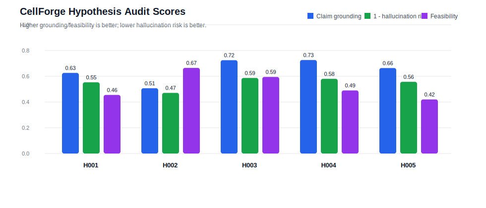
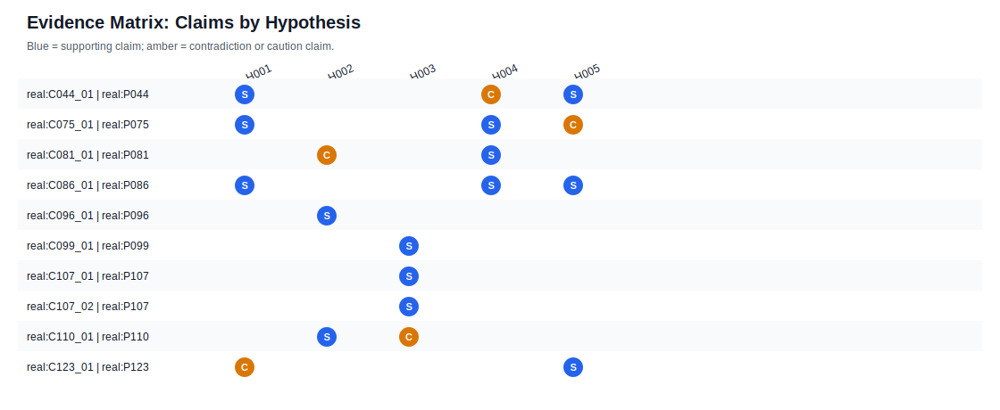
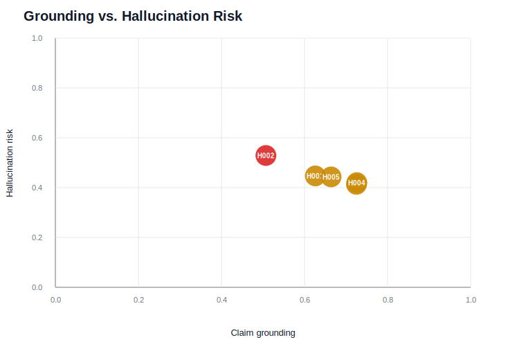
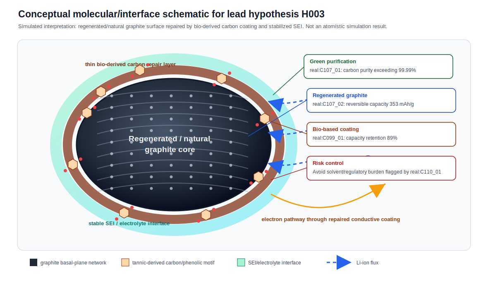

# Research Proposal Package: Green and Sustainable Electrode Materials

**System Notice:** This proposal package is generated by CellForge AI's Gemini Pro research brief writer. It is an evidence-backed research direction intended for human validation and experimental execution. All claims are derived strictly from the provided audited corpus and require human verification before publication.

---

## 1. Title Candidates
*   **Candidate 1:** Circular Natural-Graphite Anodes: Coupling Non-Thermal Plasma Purification with Bio-Derived Conductive Surface Repair
*   **Candidate 2:** A Unified Green Strategy for Graphite Anodes: Chemical-Free Regeneration and Tannic-Acid Carbon Coating
*   **Candidate 3:** Closing the Loop on Lithium-Ion Anodes: Joint Optimization of Plasma Purification and Bio-Based Surface Stabilization

---

## 2. Abstract Draft
The transition toward sustainable lithium-ion battery manufacturing requires eliminating toxic processing chemicals and energy-intensive thermal steps without compromising electrochemical performance. Current natural graphite purification relies heavily on highly toxic hydrofluoric acid (HF), while spent graphite recycling is hindered by solid-electrolyte interphase (SEI) contaminants and binder residues. We propose a circular anode strategy that pairs chemical-free non-thermal plasma (NTP) purification with a green, tannic-acid-derived carbon coating. This approach hypothesizes that NTP can upgrade natural or spent graphite purity while the bio-based coating repairs surface defects, stabilizes SEI formation, and improves charge transfer. This proposal outlines an experimental plan to validate the synergistic effects of these two green technologies on initial Coulombic efficiency, reversible capacity, and long-term cycling stability. *Note: The directional performance claims in this abstract require experimental validation.*

---

## 3. Research Goal and Scope
*   **Research Goal:** Develop green or sustainable electrode material and electrode-fabrication research directions for lithium-ion batteries while preserving battery performance.
*   **Scope:** Green and sustainable electrode materials/fabrication for lithium-ion batteries.

---

## 4. Why This Is a Gap
The current corpus highlights a fragmented approach to sustainable graphite anodes. Natural graphite is an eco-friendly alternative to energy-intensive synthetic graphite, but its conventional purification relies on highly toxic, corrosive hydrofluoric acid (HF) (`real:P107`). Furthermore, natural graphite suffers from lower initial Coulombic efficiency (85–90%) due to high surface area and edge plane exposure (`real:P107`). 

While green purification methods like non-thermal plasma (NTP) exist, and spent graphite can be regenerated using conductive polymer coatings (`real:P107`), these methods have not been jointly optimized with emerging bio-based surface repair techniques. For instance, green tannic-acid/formaldehyde self-assembly can coat graphite to improve long-term cycling, but it currently causes a drop in initial Coulombic efficiency (ICE) to 84.64% (`real:P099`). The gap lies in coupling chemical-free purification (to remove impurity-driven degradation) with thin bio-derived carbon coatings (to repair surface defects and restore ICE/electronic pathways) into a single, optimized circular manufacturing route.

---

## 5. Recommended Lead Hypothesis
**Hypothesis ID:** `real:H003`
**Title:** Circular natural-graphite anodes with bio-based conductive surface repair

**Hypothesis Statement:** We propose that green-purified or regenerated natural graphite can recover high anode performance when paired with thin bio-derived carbon or conductive polymer coatings that stabilize SEI formation and electronic pathways.

**Mechanism:** Chemical-free purification reduces impurity-driven degradation, while thin carbon/polymer coatings repair surface defects, improve charge transfer, and reduce long-cycle capacity loss.

**Novelty Rationale:** The corpus links natural graphite purification, recycled graphite regeneration, and bio-based graphite coating, suggesting a circular anode route that has not yet been jointly optimized.

**Supporting Evidence (Requires Human Validation):**
*   Non-thermal plasma (NTP) treatment serves as a chemical-free, low-temperature purification method capable of upgrading natural graphite purity to exceeding 99.99% (`real:C107_01`, `real:P107`).
*   Spent graphite regenerated using a conductive polymer coating (HOS-PFM) achieves a high reversible capacity of 353 mAh/g at 0.1C with a Coulombic efficiency of 99.93% (`real:C107_02`, `real:P107`).
*   Carbon-coated graphite (G@C) prepared via a green tannic acid/formaldehyde self-assembly process retains 89% capacity after 500 cycles at 2C (`real:C099_01`, `real:P099`).

---

## 6. Alternative Hypotheses
While `real:H003` is the recommended lead due to its strong alignment with circular economy principles and high novelty gap (0.92), the following alternatives were evaluated and deferred:

*   **`real:H001` & `real:H004` (Dry Cathode Processing):** These hypotheses focus on atmospheric plasma-assisted dry cathode interfaces (`real:H001`) and biomass-derived carbon additives (`real:H004`). While promising for eliminating NMP solvents, they face significant mechanical and transport limitations. High tortuosity limits performance at high discharge rates (`real:C075_01`, `real:P075`), and plasma treatments currently require vacuum conditions and are limited to low processing currents (3-4 mA) (`real:C044_01`, `real:P044`).
*   **`real:H002` (Water-Compatible Bio-Binders):** Proposes chitosan/PHBV biodegradable binders for graphite. However, the efficacy is heavily dependent on precursor chemistry (`real:C081_01`), and PHBV processing currently requires toxic chlorinated solvents (chloroform) and exhibits lower adhesion to copper (`real:C110_01`, `real:P110`), which contradicts the goal of eliminating hazardous chemicals.
*   **`real:H005` (Low-Energy Plasma Synthesis for NMC):** Proposes sub-second atmospheric microplasma synthesis for cathodes. This is deferred because the current state of the technology yields exceedingly small product quantities, low discharge capacity (125 mAh/g), and suffers from iron contamination due to electrode sputtering (`real:C123_01`, `real:P123`).

---

## 7. Evidence Matrix Summary
*   **Extracted Paper Count:** 9
*   **Extracted Claim Count:** 10
*   **Retrieval Metrics:** Paper Recall@5: 1.0 | Claim Recall@5: 1.0 | Hard Negative Rate@5: 0.15
*   **Quality Gate Status:** `usable_for_demo_retrieval_and_hypothesis_generation`
*   **Publication Readiness:** `not_publication_ready_without_human_validation`

The corpus provides a strong foundation of 10 human-reviewable claims spanning 9 distinct green fabrication approaches (e.g., solvent-free processing, bio-based carbon coating, green purification). All extracted claims are artifacts of the retrieval system and require human validation against the source texts.

---

## 8. Visual Evidence
*(Note: The following charts visualize the audit scores, evidence matrix, risk grounding, and molecular interfaces derived from the corpus data. Values depicted are chart-derived and require human validation.)*

*   
*   
*   
*   

---

## 9. Contradictions and Risk Controls
**Identified Contradictions & Limitations:**
*   **Bio-Material Solvent Risks:** Claim `real:C110_01` (`real:P110`) contradicts the assumption that bio-based materials are inherently greener by noting that biodegradable PHBV requires chloroform (CHCl3), a toxic chlorinated solvent, and suffers from lower adhesion. 
    *   *Risk Control:* The proposed tannic acid coating (`real:P099`) utilizes water and ethanol, avoiding chlorinated solvents. However, it requires formaldehyde as a cross-linker, which is hazardous. The experimental design must minimize or substitute formaldehyde to maintain the "green" profile.
*   **Initial Coulombic Efficiency (ICE) Drop:** The tannic acid carbon coating increases specific surface area, dropping ICE to 84.64% compared to 87.15% for pristine graphite (`real:P099`).
    *   *Risk Control:* Coating thickness and calcination temperatures must be strictly optimized to balance long-term stability (89% retention at 2C) with acceptable ICE.
*   **Scalability of Purification:** NTP treatment has high equipment costs and scaling difficulties for large-volume powder processing (`real:P107`).
    *   *Risk Control:* The proposed research should focus on lab-scale proof-of-concept and energy-burden calculations before proposing industrial scale-up.

---

## 10. Proposed Experiment Plan
We propose the following validation pathway for `real:H003`:
1.  **Material Sourcing & Purification:** Procure natural graphite and spent graphite anodes. Apply non-thermal plasma (NTP) purification to both streams. Benchmark purity against synthetic graphite controls.
2.  **Bio-Based Coating:** Apply a tannic-acid-derived carbon coating (or a conductive polymer alternative) to the purified natural and regenerated spent graphite.
3.  **Electrochemical Characterization:** Fabricate half-cells and measure:
    *   Initial Coulombic Efficiency (ICE)
    *   SEI impedance (via EIS)
    *   Reversible capacity at 0.1C
    *   Long-term capacity retention (e.g., 500 cycles at 2C)
4.  **Sustainability Assessment:** Quantify the process energy and chemical burden of the NTP + bio-coating route versus conventional HF purification and synthetic graphite production.

---

## 11. Expected Contribution
If validated, this research will provide a circular-economy anode strategy that treats sustainability and electrochemical stability as coupled design targets. It will demonstrate a viable pathway to replace toxic HF purification and energy-intensive synthetic graphite with a closed-loop, bio-repaired natural/recycled graphite system.

---

## 12. Limitations and Human Validation Checklist
**System Limitations:**
*   Hypothesis `real:H003` uses directional performance language (e.g., "recover high anode performance", "improve charge transfer") that must remain proposal-level until experimentally validated.
*   All cited real-paper claims are extraction artifacts requiring human validation.

**Human Validation Checklist:**
*   [ ] Verify the exact purity yields (>99.99%) and operating conditions of NTP treatment in `real:P107`.
*   [ ] Validate the 353 mAh/g capacity and 99.93% CE claims for HOS-PFM coated regenerated graphite in `real:P107`.
*   [ ] Confirm the 89% capacity retention at 2C and the ICE drop to 84.64% for tannic-acid coated graphite in `real:P099`.
*   [ ] Assess the safety and environmental impact of using formaldehyde in the tannic acid coating process (`real:P099`) and explore green cross-linker alternatives.
*   [ ] Review the chart-derived values in the Visual Evidence section against the raw data.

---

## 13. References
*   **`real:P044`**: *Solvent-free processing of lithium-ion batteries via plasma treatment of electrodes for adhesive interfaces*. (Green strategy: Solvent-free dry-electrode manufacturing; Limitations: Vacuum chamber required, low current limits).
*   **`real:P075`**: *High-energy density ultra-thick drying-free Ni-rich cathode electrodes for application in Lithium-ion batteries*. (Green strategy: Solvent-assisted dry electrode process using ethanol; Limitations: High tortuosity at high rates).
*   **`real:P081`**: *Comparative thermo-electrochemical study of lignin- and starch-derived carbon electrodes modified with Zn(TFSI)2 and ionic liquids for lithium-ion battery applications*. (Green strategy: Renewable biopolymer waste for carbon anodes; Limitations: High thermal processing temperatures required).
*   **`real:P086`**: *Effect of carbon black properties on dry electrode processing of cathodes for lithium-ion batteries*. (Green strategy: Solvent-free PTFE processing; Limitations: Secondary particle cracking during calendering).
*   **`real:P096`**: *Self-healable chitosan-based polymer binder for anode in lithium-ion batteries*. (Green strategy: Biodegradable chitosan binder; Limitations: Dense network limits free volume for Li-ion transport).
*   **`real:P099`**: *A green route based on pi-pi interactions to coat graphite for high-rate and long-life anodes in lithium-ion batteries*. (Green strategy: Natural plant-derived tannic acid coating; Limitations: ICE drop, requires formaldehyde cross-linker).
*   **`real:P107`**: *Natural graphite in making ecofriendly lithium-ion batteries: Challenges, current status, and future outlooks*. (Green strategy: Natural graphite use, NTP purification, spent graphite recycling; Limitations: NTP scalability, lower ICE of natural graphite).
*   **`real:P110`**: *Poly(hydroxybutyrate-co-hydroxyvalerate) as a biodegradable binder in a negative electrode material for lithium-ion batteries*. (Green strategy: Biodegradable PHBV binder; Limitations: Requires toxic chloroform solvent, lower adhesion).
*   **`real:P123`**: *One-step atmospheric microplasma synthesis of an NMC-type lithium-ion battery cathode*. (Green strategy: Elimination of high-temperature calcination; Limitations: Low yield, iron contamination, low discharge capacity).